# Sample-Efficient Domain Adaptation

### Giorgos Paraskevopoulos

---

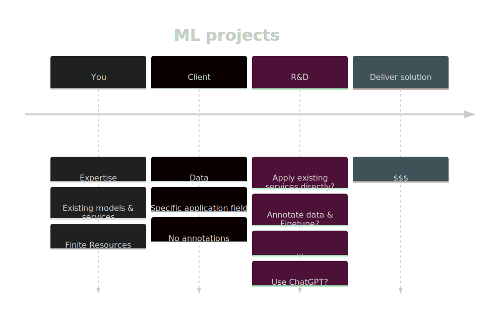

---

<!-- Presenter notes. -->

# One solution: Fast Domain Adaptation

---

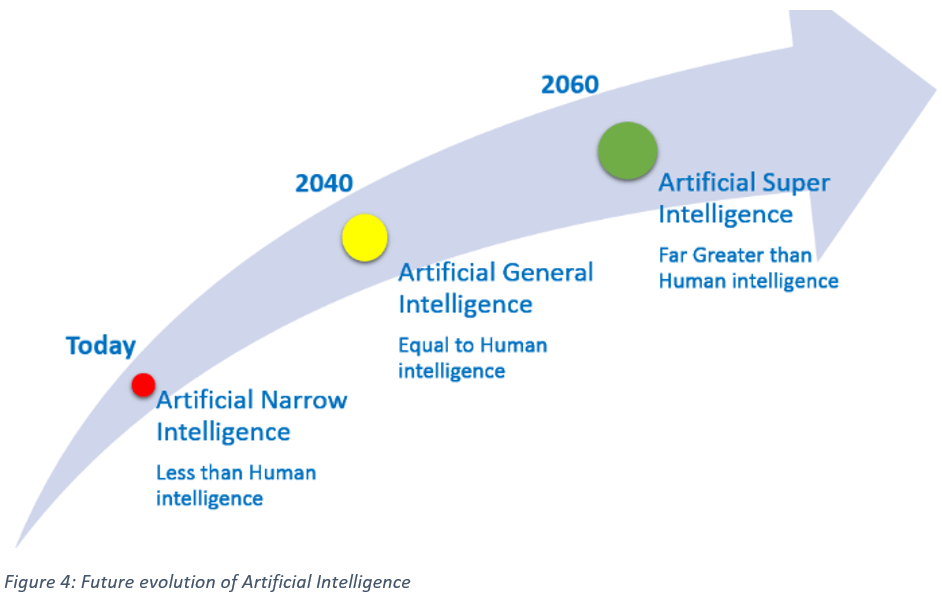

---

---

---

---

# In this presentation

### Domain adaptation to improve:

* small-ish models (300M parameters)
* with few in-domain data
* for new application settings

### Use-cases:

* Modular systems:

  * Automatic speech regognition (Language adaptation)

* End-to-end systems
 
   * Text classification (Sentiment analysis)
   * Automatic speech recognition (Acoustic adaptation)

---

# In this presentation

### Domain adaptation to improve:

* small-ish models (300M parameters)
* with few in-domain data
* for new application settings

### Use-cases:

* Modular systems:

  * Automatic speech regognition (Language adaptation)

* End-to-end systems
 
   * Text classification (Sentiment analysis)
   * Automatic speech recognition (Acoustic adaptation)

---

# Language adaptation for ASR systems

---

# Modular ASR systems

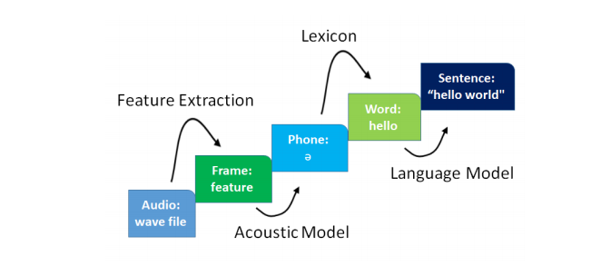

---

# Modular ASR systems

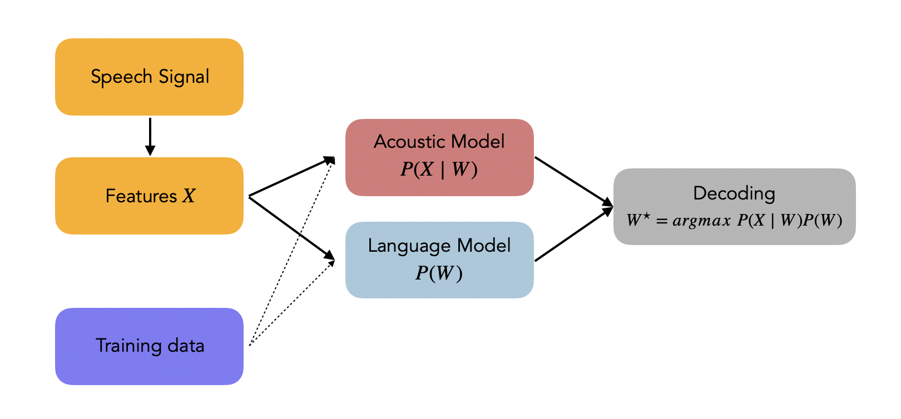

---

# 1. Collect in-domain text data

 

# 2. Add new terminology to lexicon
# 3. Adapt $P(W)$

### Very cheap: Re-train new n-gram LM and swap the old one

### Automated recipe: Trivial to apply for new settings

---

 

# 1. Collect in-domain text data

# 2. Add new terminology to lexicon

 

# 3. Adapt $P(W)$ 

### Very cheap: Re-train new n-gram LM and swap the old one

### Automated recipe: Trivial to apply for new settings

---

 

# 1. Collect in-domain text data
# 2. Add new terminology to lexicon

# 3. Adapt $P(W)$

 

### Very cheap: Re-train new n-gram LM and swap the old one

### Automated recipe: Trivial to apply for new settings

---

 

# 1. Collect in-domain text data
# 2. Add new terminology to lexicon

# 3. Adapt $P(W)$

### Very cheap: Train new n-gram LM and swap or interpolate the old one

### Automated recipe: Trivial to apply for new application domains

---

# Projects using this technique

## Plan-V

Greek aphasic speech transcription and error detection

---

# NLP-Theater Results

### Speech Recognition

| Model    | WER     |
| -------- | ------- |
| Google     | 32.4    |
| Ours unadapted | 39.2 |
| Ours adapted | **15.7** |

### Subtitle Synchronization

| Model | Error (mean) | Error (median) |
| ----- | ------------ | -------------- |
| Google |  10.30  | 3.78 |
| Ours adapted | **4.81** | 4.43 |

* Error measured in seconds
* Avoids extreme errors

> G. Bastas, et al. "Towards a DHH Accessible Theater: Real-Time Synchronization of Subtitles and Sign Language Videos with ASR and NLP Solutions." PETRA. 2022.

---

# Plan-V Results

| Lev. Distance    | Percentage    (%) |
| -------- | ------- |
| 0     | 82.0    |
| 2     | 7.0 |
| 1 | 4.5 |
| > 3 | 6.5 | 

* Adapted model necessary
* Include mispronounced versions of words in lexicon
* Measure Levenshtein distance between transcribed word and ground truth
* Example: "καλοριθέρ" $\rightarrow$ "καλοριφέρ"

---

# Domain adaptation for end-to-end models

---

# Transfer learning   Categorization


---

# Popular techniques for end to end models

### Pseudolabeling

* Train model on labeled out-of-domain data
* Use model to annotate unlabeled in-domain data
* Reduce the task to supervised learning on generated labels

### Adversarial Training

* Manipulate the latent space so that the extracted features are domain-invariant
* Use an adversarial cost so that the network can't predict the domain based on the latent features

### Self-supervision

* Use pretext tasks to gradually adapt the model to the target domain data distribution
* Learn the task on the source domain 

---

# Popular techniques for end to end models

### Pseudolabeling

* Train model on labeled out-of-domain data
* Use model to annotate unlabeled in-domain data
* Reduce the task to supervised learning on generated labels

### Adversarial Training

* Manipulate the latent space so that the extracted features are domain-invariant
* Use an adversarial cost so that the network can't predict the domain based on the latent features

### Self-supervision

* Use pretext tasks to gradually adapt the model to the target domain data distribution
* Learn the task on the source domain 

---

# Popular techniques for end to end models

### Pseudolabeling

* Train model on labeled out-of-domain data
* Use model to annotate unlabeled in-domain data
* Reduce the task to supervised learning on generated labels

### Adversarial Training

* Manipulate the latent space so that the extracted features are domain-invariant
* Use an adversarial cost so that the network can't predict the domain based on the latent features

### Self-supervision

* Use pretext tasks to gradually adapt the model to the target domain data distribution
* Learn the task on the source domain 

---

# Popular techniques for end to end models

### Pseudolabeling

*  **Pro**:   Straightforward
*  **Pro**:   Well explored in the literature
*  **Con**:  Error propagation

### Adversarial Training

*  **Pro**:   Theoretical background
*  **Pro**:   Truly e2e approach
*  **Con**:   Convergence can be challenging

### Self-supervision

*  **Pro**:  Easy to apply
*  **Pro**:   In-domain sample-efficiency
*  **Con**:   Computationally more expensive

---

# Use case 1: Sentiment Analysis

###### C. Karouzos, <ins>G. Paraskevopoulos</ins>, A. Potamianos. "UDALM: Unsupervised Domain Adaptation through Language Modeling." NAACL 2021.

---

# Step 1

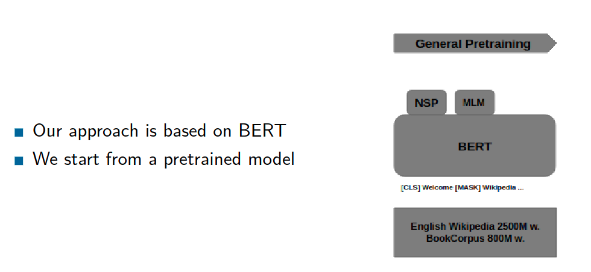

> C. Karouzos, <ins>G. Paraskevopoulos</ins>, A. Potamianos. "UDALM: Unsupervised Domain Adaptation through Language Modeling." NAACL 2021.

---

# Step 2

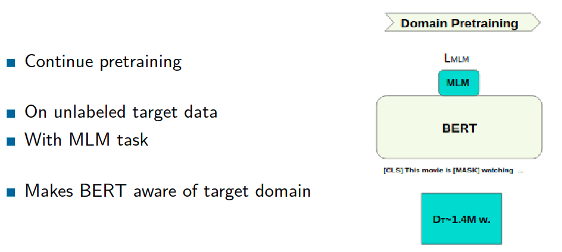

> C. Karouzos, <ins>G. Paraskevopoulos</ins>, A. Potamianos. "UDALM: Unsupervised Domain Adaptation through Language Modeling." NAACL 2021.

---

# Step 3

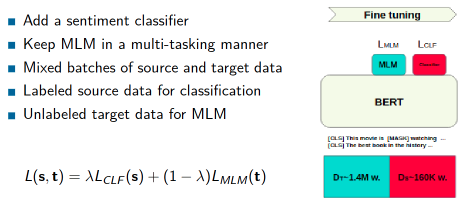

> C. Karouzos, <ins>G. Paraskevopoulos</ins>, A. Potamianos. "UDALM: Unsupervised Domain Adaptation through Language Modeling." NAACL 2021.

---

# Overview

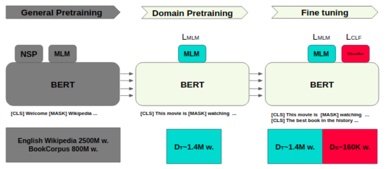

> C. Karouzos, <ins>G. Paraskevopoulos</ins>, A. Potamianos. "UDALM: Unsupervised Domain Adaptation through Language Modeling." NAACL 2021.

---

# Dataset: Amazon reviews

* Standard benchmark dataset for domain adaptation.
* Binary sentiment classification task.
* Domains: Books (**B**), DVDs (**D**), Electronics (**E**), Kitchen appliances (**K**)
* 12 adaptation scenarios of source-target domain pairs (e.g. **B** → **D**).
* 2,000 labeled reviews per domain.
* 19,809 **B**, 19,798 **D**, 19,937 **E** and 17,805 **K** unlabeled reviews.

> C. Karouzos, <ins>G. Paraskevopoulos</ins>, A. Potamianos. "UDALM: Unsupervised Domain Adaptation through Language Modeling." NAACL 2021.

---

# Results

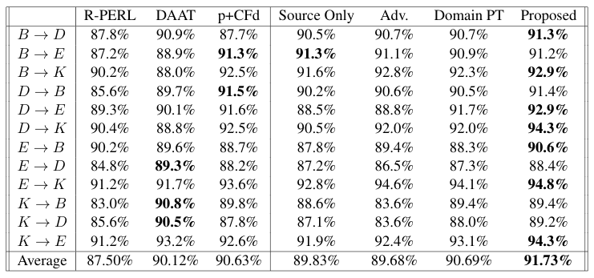

> C. Karouzos, <ins>G. Paraskevopoulos</ins>, A. Potamianos. "UDALM: Unsupervised Domain Adaptation through Language Modeling." NAACL 2021.

---

# Sample-Efficiency

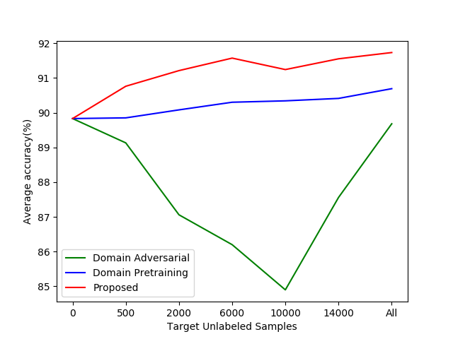

> C. Karouzos, <ins>G. Paraskevopoulos</ins>, A. Potamianos. "UDALM: Unsupervised Domain Adaptation through Language Modeling." NAACL 2021.

---

# Use case 2: Adaptation of XLSR-53 for ASR

###### <ins>G. Paraskevopoulos</ins> et al., Sample-Efficient Unsupervised Domain Adaptation of Speech Recognition Systems: A case study for Modern Greek, under revision IEEE/ACM TASL-P

---

# Key take-aways

* Apply ideas from UDALM for acoustic adaptation of XLSR-53 
  * Multi-domain instead of in-domain self-supervision 
* Combine with simple language adaptation techniques
* Apply for cross-corpus speech recognition in Greek
* Demonstrate sample-efficiency
* New corpus: Hellenic Parliament recordings (120 hours)

> <ins>G. Paraskevopoulos</ins>, T. Kouzelis, G. Rouvalis, A. Katsamanis, V. Katsouros, A. Potamianos, Sample-Efficient Unsupervised Domain Adaptation of Speech Recognition Systems: A case study for Modern Greek, under revision IEEE/ACM TASL-P
--- 

# M2DS2: Mixed Multi-domain Self-Supervision

Method similar with UDALM
* No Continual Pretraining step
* Add source domain self-supervision in multitask loss
* Avoid mode-collapse of discrete code-vectors
  

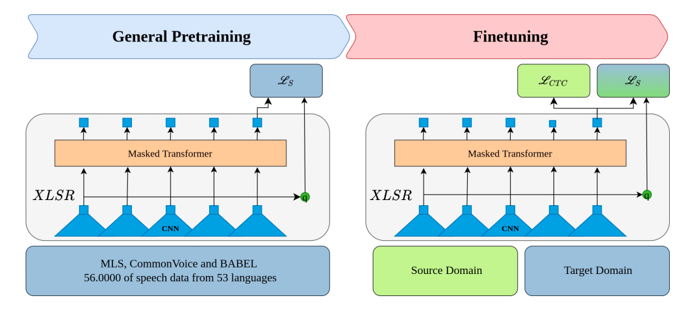

$L = L_{CTC}(\text{source samples}) + \alpha \cdot L_{SS}(\text{source samples}) + \beta \cdot L_{SS}(\text{target samples})$

> <ins>G. Paraskevopoulos</ins>, T. Kouzelis, G. Rouvalis, A. Katsamanis, V. Katsouros, A. Potamianos, Sample-Efficient Unsupervised Domain Adaptation of Speech Recognition Systems: A case study for Modern Greek, under revision IEEE/ACM TASL-P

---

# Corpora

<!-- 
 -->

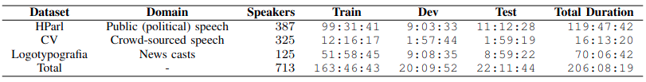

* 6 adaptation scenarios between Logotypografia (LG), Common Voice (CV) and HParl (HP)

<!-- 
 -->

> <ins>G. Paraskevopoulos</ins>, T. Kouzelis, G. Rouvalis, A. Katsamanis, V. Katsouros, A. Potamianos, Sample-Efficient Unsupervised Domain Adaptation of Speech Recognition Systems: A case study for Modern Greek, under revision IEEE/ACM TASL-P

---

# Results 

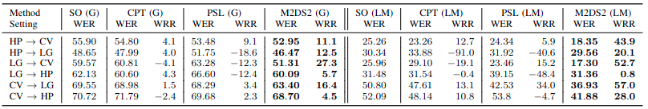

* WER $\rightarrow$ Word Error Rate $\quad$ WRR $\rightarrow$ Relative adaptation improvement (%)
* G $\rightarrow$ Greedy decoding $\quad$ LM $\rightarrow$ Generic LM reweighting

> <ins>G. Paraskevopoulos</ins>, T. Kouzelis, G. Rouvalis, A. Katsamanis, V. Katsouros, A. Potamianos, Sample-Efficient Unsupervised Domain Adaptation of Speech Recognition Systems: A case study for Modern Greek, under revision IEEE/ACM TASL-P

--- 

# Sample Efficiency

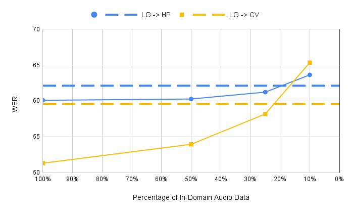

> <ins>G. Paraskevopoulos</ins>, T. Kouzelis, G. Rouvalis, A. Katsamanis, V. Katsouros, A. Potamianos, Sample-Efficient Unsupervised Domain Adaptation of Speech Recognition Systems: A case study for Modern Greek, under revision IEEE/ACM TASL-P

---

# Combine with LM adaptation

* Biased LM: 
  * Train N-gram LM on in-domain data
* Augmented LM:
  * Train N-gram LM on in-domain data
  * Use in-domain LM to filter lines with low perplexity from large corpus
  * Tran N-gram LM on augmented data

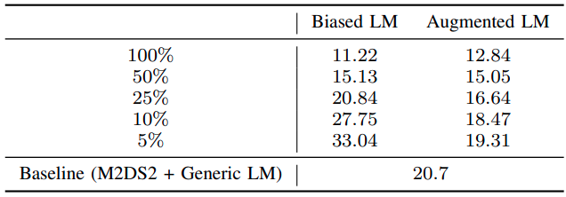

  

> <ins>G. Paraskevopoulos</ins>, T. Kouzelis, G. Rouvalis, A. Katsamanis, V. Katsouros, A. Potamianos, Sample-Efficient Unsupervised Domain Adaptation of Speech Recognition Systems: A case study for Modern Greek, under revision IEEE/ACM TASL-P

---

# What we gain overall?

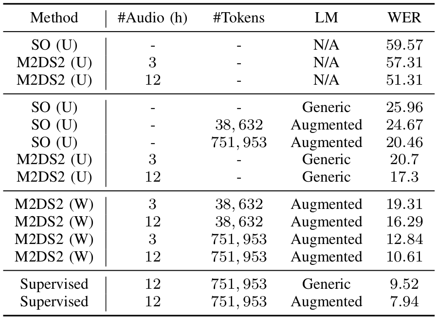

> <ins>G. Paraskevopoulos</ins>, T. Kouzelis, G. Rouvalis, A. Katsamanis, V. Katsouros, A. Potamianos, Sample-Efficient Unsupervised Domain Adaptation of Speech Recognition Systems: A case study for Modern Greek, under revision IEEE/ACM TASL-P

--- 

# Conclusions

Under some closed world assumptions (known application domain) we can improve performance with

1. few in-domain data without annotations
2. in-domain self-supervision to avoid catastrophic forgetting

The techniques presented are:

1. simple to implement
2. evaluated in diverse settings
3. domain-invariant (no domain expertise needed)

<!-- 
 -->
